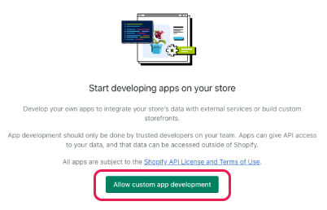
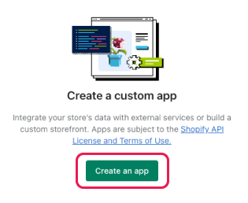
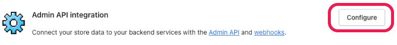

# Step 1 - Shopify App Installation

⏱️ 5 minutes

The first step is to create a custom app within your Shopify site. This app will provide secure access to a limited set of your Shopify data, which can then be utilised by Zoom Contact Center to help you personalise your inbound customer experiences.

## 1.1 Creating a custom app in Shopify

Here’s how to create your custom app in Shopify:

- Log into your Shopify Admin console
- Navigate to **Settings** (on desktop, the settings cog is at the bottom left of your screen)
- Select **Apps and sales channels**
- Under **Build custom apps for your unique needs** click **Develop apps for your store**
- If this is the first time you’ve created a custom app for Shopify, you will see this message:

  

- Click **Allow custom app development**, and then in the next screen, once again, click **Allow custom app development**

  

- Click **Create an app**
- Select an **App developer** from the dropdown (usually your own username)
- Click **Create app**

## 1.2 Configure the app, and generate an API key

Now that the application has been created, we need to configure it, to tell it which data we want Zoom to be able to access. Finally, we need to generate a secure API key that Zoom Contact Center can use to request the data on demand.

- Within the Zoom Accelerator app settings:
- Select the **Configuration** tab
- Navigate to Admin API Integration, and select **Configure**

  

- Within the Admin **API access scopes** section, select the following scopes:

  - read_customers
  - read_fulfillments
  - read_orders

- Then click the **Save** button
- Select the **API credentials** tab

  - Within the **Access tokens** section:

    - Click **Install app**
    - Click **Install** in the confirmation dialog

  - Within the **Admin API access token** section:

    - Click **Reveal token once** (please note that the token can only be displayed once, so it’s vital that you store this somewhere securely such as your chosen password safe)
    - When the access token is displayed, click the **clipboard icon** on the right of the token to copy the token
    - IMPORTANT - Store the token securely - please note that the token can only be displayed once, so it’s vital that you store this somewhere securely such as your chosen password safe
    - Your API token will be needed when configuring `apiKey` custom variable within Zoom Contact Center Administration, as detailed later within this guide.

Your custom Shopify app is now fully configured and we are almost ready to move across to the Zoom Admin Console. Before we do that, make sure that you have taken a copy of the important information listed below. _We strongly recommend that these values are stored in your chosen password safe._

## IMPORTANT - Shopify information needed for the next step

Before moving into the Zoom Admin console, please make sure that you have the following values to hand from your Shopify store. Do not navigate away from the Shopify API Credentials screen until you have copied and stored your token.

| Item       | Description                                                                                                                                                                          | Example value                           |
| ---------- | ------------------------------------------------------------------------------------------------------------------------------------------------------------------------------------ | --------------------------------------- |
| API Key    | Provides access to your data using the Shopify Admin API Access Token. This is as detailed in the previous set of instructions. You will have made a note of this in a secure place. | `shpab_50c94bd4e91343a77d098b6d937c6f8` |
| Store Name | The value which uniquely identifies your Shopify store in the URL. URL format: https://[store-name].myshopify.com Example URL: `https://test-store.myshopify.com`                    | `test-store`                            |

## Next Step

[Step 2 - Zoom Contact Center Configuration](step-2.md)

---

## Installation Index

[Zoom Contact Center &amp; Shopify Accelerator](../README.md)

[Step 1: Shopify App Installation](step-1.md)

[Step 2: Zoom Contact Center Configuration](step-2.md)

[Step 3: Voice Channel Configuration](step-3.md)

[Step 4: Web Chat Channel Configuration](step-4.md)

[Step 5: Testing](step-5.md)

[Step 6: Customising the Flows](step-6.md)
