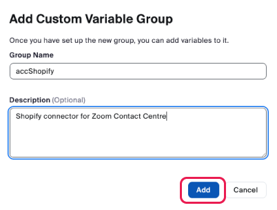

# Step 2 - Zoom Contact Center Configuration

## 2.1 Create Custom Variables in Zoom Contact Center

⏱️ 15 minutes

Custom variables are used within Zoom Contact Center to enable the Shopify Accelerator to function and to store the data retrieved from your Shopify account, for each engagement.

- Login to the Zoom Admin Console
- In the left menu, under Admin, navigate to **Contact Center Management**, then select **Preferences**
- Select the **Variables** tab (this is where you define the variables which collect and pass data in Zoom Contact Center)
- Click the **+ Add Custom Group** option

  - Within the dialog box, enter the name `accShopify`
  - Add the description - `Shopify connector for Zoom Contact Center - by acceleraate.com`
  - Click **Add**

  

- Select the newly created **accShopify** group on the left and then click + **Add Variable**
- Create the variables listed below within the **accShopify** group and confirm that they’ve been added correctly and are listed in the table of variables.
- Please ensure that the Variable Name is copied exactly as shown in the table below, paying close attention to case and format:

| Variable Name          | Description                                                                                                                                                                         | Variable Type   | Conditions | Data Type | Value                                                                                                                                          |
| ---------------------- | ----------------------------------------------------------------------------------------------------------------------------------------------------------------------------------- | --------------- | ---------- | --------- | ---------------------------------------------------------------------------------------------------------------------------------------------- |
| `apiKey`               | Shopify API key for providing permission to call APIs                                                                                                                               | Global Variable | None       | String    | Linked Value Value: [Enter your Shopify API key as detailed in a previous step] 🔒 Value can only be changed by editing this variable          |
| `storeName`            | Value which uniquely identifies the Shopify store in the URL                                                                                                                        | Global Variable | None       | String    | Linked Value Value: [Enter your Shopify Store Name value as detailed in a previous step] 🔒 Value can only be changed by editing this variable |
| `errorCode`            | ACC Shopify Error Code returned                                                                                                                                                     | Global Variable | None       | String    | Undefined                                                                                                                                      |
| `errorMessage`         | ACC Shopify Error Message returned                                                                                                                                                  | Global Variable | None       | String    | Undefined                                                                                                                                      |
| `searchMethod`         | The method of searching for a customer or order                                                                                                                                     | Global Variable | None       | String    | Undefined                                                                                                                                      |
| `customerId`           | A unique identifier for the customer                                                                                                                                                | Global Variable | None       | Number    | Undefined                                                                                                                                      |
| `customerEmail`        | The unique email address of the customer                                                                                                                                            | Global Variable | None       | Email     | Undefined                                                                                                                                      |
| `customerFirstName`    | The customer's first name                                                                                                                                                           | Global Variable | None       | String    | Undefined                                                                                                                                      |
| `customerLastName`     | The customer's last name                                                                                                                                                            | Global Variable | None       | String    | Undefined                                                                                                                                      |
| `customerPhone`        | The unique phone number (E.164 format) for this customer                                                                                                                            | Global Variable | None       | String    | Undefined                                                                                                                                      |
| `customerOrdersCount`  | The number of orders associated with this customer                                                                                                                                  | Global Variable | None       | Number    | Undefined                                                                                                                                      |
| `customerLastOrderId`  | The ID of the customer's last order                                                                                                                                                 | Global Variable | None       | String    | Undefined                                                                                                                                      |
| `customerNote`         | A note about the customer                                                                                                                                                           | Global Variable | None       | String    | Undefined                                                                                                                                      |
| `customerState`        | The state of the customer's account with a shop                                                                                                                                     | Global Variable | None       | String    | Undefined                                                                                                                                      |
| `customerTags`         | Tags that the shop owner has attached to the customer, formatted as a string of comma-separated values. A customer can have up to 250 tags. Each tag can have up to 255 characters. | Global Variable | None       | String    | Undefined                                                                                                                                      |
| `customerTotalSpent`   | The total amount of money that the customer has spent across their order history                                                                                                    | Global Variable | None       | Number    | Undefined                                                                                                                                      |
| `orderId`              | A unique identifier for the order                                                                                                                                                   | Global Variable | None       | Number    |
| `orderNumber`          | Supports either the order number or order name                                                                                                                                      | Global Variable | None       | String    | Undefined                                                                                                                                      |
| `orderStatus`          | Fulfilment status of the order. Possible values: `Confirmed` , `On its way` , `Out for delivery` , `Delivered` , `Attempted delivery`                                               | Global Variable | None       | String    | Undefined                                                                                                                                      |
| `orderPaymentStatus`   | Financial status of the order. Possible values: `pending` , `authorized` , `partially_paid` , `paid` , `partially_refunded` , `refunded` , `voided`                                 | Global Variable | None       | String    | Undefined                                                                                                                                      |
| `orderShippingAddress` | Order shipping address stored as a JSON object                                                                                                                                      | Global Variable | None       | String    | Undefined                                                                                                                                      |
| `orderCancelReason`    | The reason why the order was canceled                                                                                                                                               | Global Variable | None       | String    | Undefined                                                                                                                                      |
| `orderCancelledAt`     | The date and time when the order was canceled. Returns null if the order isn't canceled                                                                                             | Global Variable | None       | String    | Undefined                                                                                                                                      |
| `orderLineItems`       | Order line items stored as a JSON object                                                                                                                                            | Global Variable | None       | String    | Undefined                                                                                                                                      |
| `orderNote`            | An optional note that a shop owner can attach to the order                                                                                                                          | Global Variable | None       | String    | Undefined                                                                                                                                      |
| `orderPhone`           | The phone number associated with the order in E164 format                                                                                                                           | Global Variable | None       | String    | Undefined                                                                                                                                      |
| `orderTotalPrice`      | The total amount for the order including all line items, shipping and any promotions                                                                                                | Global Variable | None       | Number    | Undefined                                                                                                                                      |

---

## Next Step

Follow the steps below based on the channels you're using with Zoom Contact Center:

[Step 3 - Voice Channel Configuration](step-3.md)

[Step 4 - Web Chat Channel Configuration](step-4.md)

---

## Installation Index

[Zoom Contact Center &amp; Shopify Accelerator](../README.md)

[Step 1 - Shopify App Installation](step-1.md)

[Step 2 - Zoom Contact Center Configuration](step-2.md)

[Step 3 - Voice Channel Configuration](step-3.md)

[Step 4 - Web Chat Channel Configuration](step-4.md)

[Step 5 - Testing the Shopify Accelerator](step-5.md)

[Step 6 - Customising the Flows](step-6.md)
