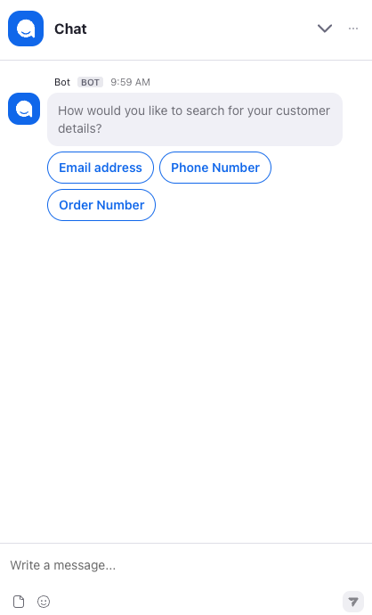
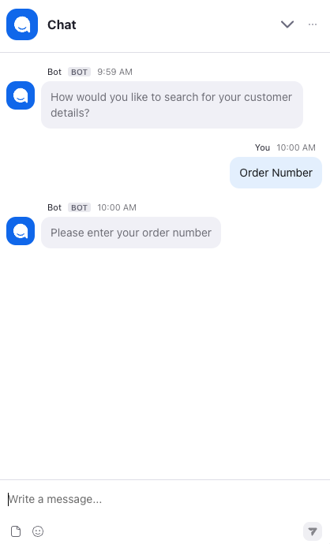
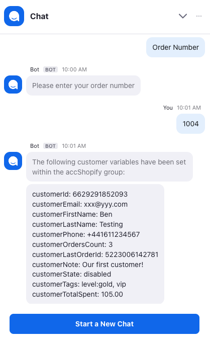
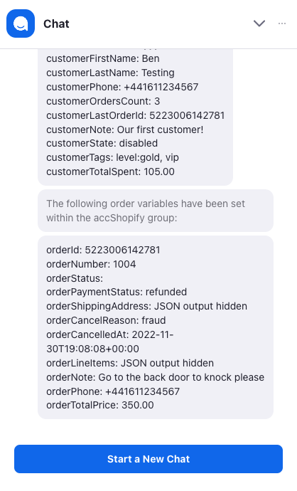

# Step 5 - Testing the Shopify Accelerator

## 5.1 Testing Overview

To test the Shopify Accelerator you’ll need some customer/order details from your Shopify account. You’ll need one or more of the following:

- Customer email address
- Customer phone number
- Order number

## 5.1 Testing the Voice Channel

- Dial the phone number you attached as an entry point to the **accShopifyVoice** flow
- When prompted, either select to search by phone number or order number
- Use your key[ad to enter the number type you selected
- If everything has been set up correctly, the flow will read out details of the customer/order found and the custom variables you created in Step 2 will have been populated with Shopify data.
  If there are errors then details will spoken to you with further information in the debug log.

## 5.2 Testing the Web Chat Channel

- Open up your website and navigate to page where the script tag has been added from the previous step
- The Zoom web chat icon will appear
- Click the icon to start the web chat and enter your details
  Once the chat starts then the accShopifyWebChat flow will run and you can test the Shopify integration. First you’ll be asked how you’d like to search. Simply follow the steps and provide the information requested. If everything is working properly, the information gathered from your Shopify account will be displayed to you in the chat window.
  If there are any errors, then these will be displayed along with the error codes listed below in the Troubleshooting section.

### Example Web Chat Interaction

The screenshots below show an example interaction. The flow asks how you'd like to search, collects the data, calls the Shopify APIs to retrive customer and order data, then finally displays the data. This interaction is designed to confirm to you that the webchat is working as designed. Please refer to [Step 6 - Customising the Flows](step-6.md) to understand what needs to be done to make these flows your own and suitable for your customers.

&nbsp;&nbsp;&nbsp;&nbsp;

&nbsp;&nbsp;&nbsp;&nbsp;

## Error Codes

If errors are encountered during the processing of the flow, then use the code returned in the error message and the list below to check for troubleshooting steps.

Error: `1001` - No API Key defined

- The API key is the security mechanism used by Shopify to authorise calls to their API to retrieve your customer and order details.
- Check that you’ve taken the API key from Step 1 and entered it as a linked value against the apiKey Zoom Contact Centre Global Variable you created in Step 2.
- If you didn’t make a note of your API Key then you will need to Uninstall the Custom App in Shopify and repeat Step 1.

Error: `1002` - No Store Name defined

- The Store Name value is what’s used to uniquely identify your Shopify store in the URL:
  - URL format: `https://[store-name].myshopify.com`
  - Example URL: `https://test-store.myshopify.com`
- In the above example, the value needed would be test-store however the value needed will be specific to your own store.
- Check that you’ve got the correct store name and entered it as a linked value against the storeName Zoom Contact Centre Global Variable you created in Step 2.

Error: `1003` - No variables set

- None of the required pre-execution Global Variables were set. The test flow provided will prompt the end-user for one of the following values:
  - Customer email
  - Customer phone
  - Order number
- If you’ve modified the flows to include your own logic, then make sure that you’ve set one of the following variables in your flow:
  - `global_custom.accShopify.customerEmail`
  - `global_custom.accShopify.customerPhone`
  - `global_custom.accShopify.orderNumber`
- Refer to the Zoom documentation on how to set global variables within the Script widget.

Error: `1004` - Supplied email address not valid

- The value provided as an email address to the `customerEmail` variable wasn’t valid

Error: `1005` - Supplied phone number not valid

- The value provided to the customerPhone variable wasn’t valid. Phone numbers must be in the E164 standard e.g. For example:
  - UK number `0161 123 4567` in E164 format is `441611234567`
  - UK mobile number `07777 123 456` in E164 format is `447777123456`
  - USA number `555-513-0514` in E164 format is `15555130514`
  - Please note that the `+` is not needed when carrying out a search, however the script below accepts it but will strip it from the return value

Error: `2001` - Authentication failed

- Double-check that the `apiKey` and `storeName` Zoom Global Variables are set to the correct values for the same Shopify store
- Verify that the Shopify app you created in an earlier step, hasn't been uninstalled

Error: `2002` - Timeout

- Check the [Shopify Status Page](https://www.shopifystatus.com/) for details of any current technical issues
- Check the [Zoom Status Page](https://status.zoom.us/) for details of any current technical issues
- Try calling the [Zoom API](https://shopify.dev/docs/api/admin-rest) using a tool like [Postman](https://www.postman.com/)

Error: `3001` - Customer not found using email address

- Check that the email address matches a customer in your Shopify account
- Use the Shopify admin portal to search for a customer using the same value
- Double-check that the `apiKey` and `storeName` Zoom Global Variables are set to the correct values for the same Shopify store.
- If using your own flow logic then consider implementing the function in a script block detailed in Error `1004` to make sure that the email is in the expected format.

Error: `3002` - Customer not found using phone number

- Check that the phone number entered matches a customer in your Shopify account
- Use the Shopify admin portal to search for a customer using the same value
- Double-check that the `apiKey` and `storeName` Zoom Global Variables are set to the correct values for the same Shopify store.
- If using your own flow logic then consider implementing the function in a script block detailed in Error `1005` to make sure that the phone number is in E164 format.

Error: `3003` - Order not found

- Check that the order number entered matches a customer in your Shopify account
- Use the Shopify order number to search and not the order ID - the order number can be either with or without the leading # character
- Use the Shopify admin portal to search for a customer using the same value
- Double-check that the `apiKey` and `storeName` Zoom Global Variables are set to the correct values for the same Shopify store.

Error: `9000` - Unexpected error

- A script block resulted in an unexpected error
- The error message will include a description of the error, the name of the flow and the name of the block where the error occured

## Debugging the Flows

If the error codes provided don't help you resolve your issue, you'll need to debug the flow from within the Zoom Contact Center management portal. Ths will provide you with a log of every step within the flow to help you resolve the issue. Refer to the [Zoom Support documentation on how to debug a flow](https://support.zoom.us/hc/en-us/articles/5646354933261-Debugging-a-flow#:~:text=In%20the%20navigation%20menu%2C%20click,ellipses%20icon%20%2C%20then%20click%20Debug.).

## Next Step

[Step 6: Customising the Flows](step-6.md)

---

## Installation Index

[Zoom Contact Center &amp; Shopify Accelerator](../README.md)

[Step 1 - Shopify App Installation](step-1.md)

[Step 2 - Zoom Contact Center Configuration](step-2.md)

[Step 3 - Voice Channel Configuration](step-3.md)

[Step 4 - Web Chat Channel Configuration](step-4.md)

[Step 5 - Testing the Shopify Accelerator](step-5.md)

[Step 6 - Customising the Flows](step-6.md)
