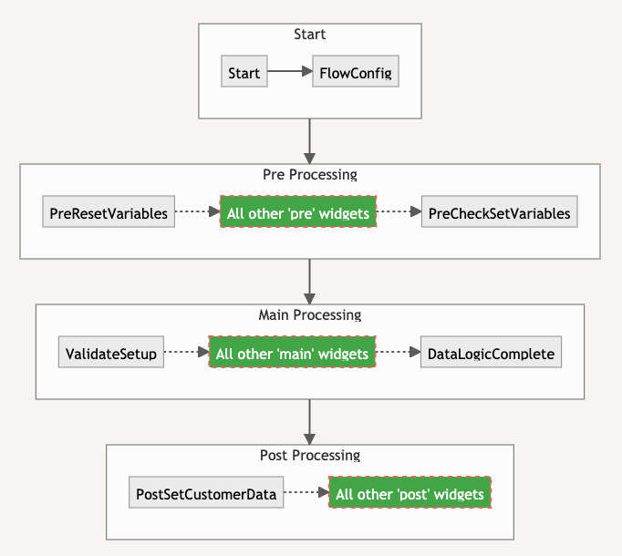

# Step 6 - Customising the Flows

The flows you just created contain all the necessary logic to capture the values from the user, call into Shopify using their API, and then confirm the Shopify data retrieved. You will need to make your own customisations to the Zoom Contact Center flows to add your own logic and implement your own CX journeys. To customise the flows we recommend that you or your team have the following skills:

- Knowledge of Zoom Contact Center
- Ability to create Flows in Zoom Contact Center
- Basic JavaScript skills
- Experience building your own automated customer journeys

## Shopify Accelerator Flow Layout

### High Level Flow Layout

The Shopify Accelerator Flows are organised on the canvas with widgets in the following logical groups.


### Low Level Flow Layout

This lower-level diagram shows how the widgets themselves link together. Please note that not all widgets are shown - only the first and last widgets from each group. All other widgets in the group are grouped together and shown in green.



## Pre Processing

All Pre Processing widgets in the flow are prefixed with `Pre` in the widget name. These widgets are used by default to capture the information needed to lookup the customer or order data within Shopify. When customising the flow to include your own logic, **at least one** of the following Zoom Global Custom Variables must be set.

```javascript
global_var_set("global_custom.accShopify.orderNumber", "1001");
global_var_set("global_custom.accShopify.customerEmail", "customer@email.com");
global_var_set("global_custom.accShopify.customerPhone", "447777123456");
```

The main processing widgets will use the following order of priority when calling the Shopify API to lookup customer/order details:

1. Order Number (voice and web chat)
2. Customer Email (web chat only)
3. Customer Phone (voice and web chat)

If you want to force a specific search method then you can set the `searchMethod` Global Variable either using a SetVariable widget or a Script widget. Setting this variable is optional as long as you’ve set at least one of the three required search variables.

```javascript
// force the search by order number
global_var_set("global_custom.accShopify.searchMethod", "orderByNumber");
// OR force the search by customer email
global_var_set("global_custom.accShopify.searchMethod", "customerByEmail");
// OR force the search by customer phone number
global_var_set("global_custom.accShopify.searchMethod", "customerByPhone");
```

The final widget in the pre processing section `PreCheckSetVariables`, makes sure that all necessary data has been captured to start the main processing.

## Main Processing

The main processing section handles the interaction with Shopify, calling the API to obtain customer and order details using the data captured in pre processing.

- **Searching by order number**
  If searching by order number, the Shopify `orders` endpoint is initially called passing in the order number provided. The order data returned includes basic customer details, which can then be used to retrieve more data using the `customers` endpoint.
- **Search by phone or email**
  If searching by phone number or email. the Shopify `customers` endpoint is called. This includes the ID of the customer’s most recent order. The Shopify `orders` endpoint is then called to retrieve data for their most recent order.

At the end of the main processing, both customer and order details will have been successfully retrieved from Shopify and the custom variables populated within Zoom Contact Center. If customer/order details can’t be found using the details provided, error codes will be returned in the following global variables:

- `global_custom.accShopify.errorCode`
- `global_custom.accShopify.errorMessage`

To get these error values, either run the flow in debug mode where any errors encountered will be logged or check the variables within the flow:

```javascript
var_get()["global_custom.accShopify.errorCode"];
var_get()["global_custom.accShopify.errorMessage"];
```

A full list of error codes and troubleshooting steps is provided in [Step 5 - Testing the Shopify Accelerator - Error Codes](step-5.md#error-codes)

## Post Processing

The post processing widgets currently only confirm the Shopify customer/order details back either by voice or web chat message. This is where you’ll need to use the global variables set by the accelerator and the functionality in Zoom Contact Center Flows to build out your automated journeys. The next section contains some example scripts that you might find useful to help you get started.

```javascript
var_get()["customerId"]; // integer
var_get()["customerEmail"]; // string
var_get()["customerFirstName"]; // string
var_get()["customerLastName"]; // string
var_get()["customerPhone"]; // string
var_get()["customerOrdersCount"]; // integer
var_get()["customerLastOrderId"]; // integer
var_get()["customerNote"]; // string
var_get()["customerState"]; // string
var_get()["customerTags"]; // csv string of tags
var_get()["customerTotalSpent"]; // number
var_get()["orderId"]; // integer
var_get()["orderNumber"]; // string
var_get()["orderStatus"]; // string
var_get()["orderPaymentStatus"]; // string
var_get()["orderShippingAddress"]; // stringified JSON object containing all shipping address details
var_get()["orderCancelReason"]; // string
var_get()["orderCancelledAt"]; // string
var_get()["orderLineItems"]; // stringified JSON object containing all order line items
var_get()["orderNote"]; // string
var_get()["orderPhone"]; // string
var_get()["orderTotalPrice"]; // number
```

## Example Scripts

Zoom Contact centre currently supports adding JavaScript using the Script widget in Flows. Please refer to the [Zoom documentation for customising the script widget](https://support.zoom.us/hc/en-us/articles/4472775944845-Customizing-the-Script-widget).

### Setting custom global variables within the Zoom Flow Script widget

Use the `global_var_set` function to set the value for a global variable. The first parameter is the full name of the global variable; the second parameter is the value.

```javascript
global_var_set("global_custom.accShopify.customerEmail", "test@example.com");
```

### Getting custom global variables within the Zoom Flow Script widget

Use the `var_get` function to get the value of the variable. The `var_get` function can access the value of both local widget and global variables.

```javascript
var_get()["global_custom.accShopify.customerEmail"];
```

### Validating an email address

Use this function in your flows to carry out a **basic** check that the customer has entered a correctly formatted email address

```javascript
function isValidEmailAddress(valueToCheck) {
  if (/[a-zA-Z0-9_.]+@[a-zA-Z0-9]+\.[a-zA-Z]{2,3}/.test(valueToCheck)) {
    return true;
  } else {
    return false;
  }
}
```

### Converting a phone number to E164 format

Use this function in your flows to convert a phone number inputted by your customer, to E164 format. Phone numbers in Shopify are stored in this format, so when searching by phone number, it’s important that you send the value through correctly.

The function assumes that any number entered without an international prefix is a UK number. If this doesn’t match your own requirements then you will need to modify the code.

Please note that this example only performs some rudimentary checks and that more complete libraries for validating and formatting phone numbers are available elsewhere.

```javascript
function enforcePhoneNumberPattern(stringNumber) {
  let newString = stringNumber.match(/[0-9]{0,14}/g);
  let defaultCountryPrefix = "44"; // UK country code
  if (newString === null) {
    return "";
  }
  newString = newString.join("");
  // defaults numbers to UK if not already specified
  // if (!newString.startsWith("44")){
  if (newString.startsWith("0")) {
    newString = newString.substring(1, 15);
    newString = defaultCountryPrefix + newString;
  }
  // }
  // Limit length to 15 characters
  newString = newString.substring(0, 15);
  return newString;
}
```

### Useful Zoom Contact Center Links

[Flow Editor](https://support.zoom.us/hc/en-us/sections/4424229774861-Flow-Editor)

[Customising the Send Media widget](https://support.zoom.us/hc/en-us/articles/4472904469133-Customizing-the-Send-Media-widget-)

[Customising the Collect Input widget](https://support.zoom.us/hc/en-us/articles/4472814200333-Customizing-the-Collect-Input-widget)

[Customising the Script widget](https://support.zoom.us/hc/en-us/articles/4472775944845-Customizing-the-Script-widget)

[Script widget examples](https://support.zoom.us/hc/en-us/articles/8323536773645-Script-widget-examples)

## Next Step

Do you need more help customising your flows? We'd be happy to help. Get in touch with us at [support@acceleraate.com](mailto:support@acceleraate.com)

---

## Installation Index

[Zoom Contact Center &amp; Shopify Accelerator](../README.md)

[Step 1 - Shopify App Installation](step-1.md)

[Step 2 - Zoom Contact Center Configuration](step-2.md)

[Step 3 - Voice Channel Configuration](step-3.md)

[Step 4 - Web Chat Channel Configuration](step-4.md)

[Step 5 - Testing the Shopify Accelerator](step-5.md)

[Step 6 - Customising the Flows](step-6.md)
